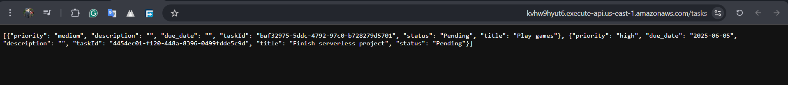

---

## 📘 Serverless To-Do API – AWS Lambda, API Gateway, DynamoDB

This project is a **serverless REST API** for managing to-do tasks, built using:

* **Amazon API Gateway** for routing HTTP requests
* **AWS Lambda** for executing backend logic
* **Amazon DynamoDB** as the NoSQL database
* **Amazon S3** to host the frontend (optional)
* **Terraform** for infrastructure as code

---

## 🧩 Architecture

```plaintext
Client (browser/cURL)
      ↓
API Gateway (REST)
      ↓
Lambda Functions (CRUD handlers)
      ↓
DynamoDB Table (Tasks)
```

---

## 🛠️ Technologies Used

* Terraform
* AWS Lambda (Python)
* Amazon API Gateway
* Amazon DynamoDB
* Amazon S3 (frontend hosting)
* IAM (execution roles & permissions)
* CloudWatch (logs)

---

## 🚀 Features

* ✅ Create a new task
* 📖 Get all tasks
* ✏️ Update a task
* ❌ Delete a task

---

## 🧪 API Endpoints

| Method | Endpoint          | Description   |
| ------ | ----------------- | ------------- |
| POST   | `/tasks`          | Create task   |
| GET    | `/tasks`          | Get all tasks |
| PUT    | `/tasks/{taskId}` | Update task   |
| DELETE | `/tasks/{taskId}` | Delete task   |

> Example base URL:
> `https://61d6ys5is6.execute-api.us-east-1.amazonaws.com`

---

## 📝 Example Requests

### ✅ Create Task

```bash
curl -X POST https://<api_url>/tasks \
  -H "Content-Type: application/json" \
  -d '{"id": "task1", "title": "Finish serverless project", "priority": "high", "due_date": "2025-06-05"}'

  (post.png)
```

### 📖 Get All Tasks

```bash
curl https://<api_url>/tasks
```

### ✏️ Update Task

```bash
curl -X PUT https://<api_url>/tasks/{taskId} \
  -H "Content-Type: application/json" \
  -d '{"title":"Play", "priority":"medium"}'
(put.png)
```

### ❌ Delete Task

```bash
curl -X DELETE https://<api_url>/tasks/{taskId}
(delete.png)
```

---

## 📷 Screenshots

| Description             | Screenshot                                        |
| ----------------------- | ------------------------------------------------- |
| Terraform apply Output   |  |
| Lambda Function Code    |        |
| DynamoDB Table View     |        |
| API Gateway Test        |      |
|    |


---

## 🧰 Setup Instructions (Terraform)

1. Clone the repo

```bash
terraform init
terraform apply
```

4. Deploy your Lambda code (zipped `.zip` file)
5. Test the API using Postman or `curl`

---

## 📚 Learning Outcomes

* Design and deploy serverless applications with best practices
* Use AWS Lambda + API Gateway + DynamoDB for REST APIs
* Write Terraform to manage cloud infrastructure
* Secure resources with IAM roles and policies
* Use CloudWatch for debugging and monitoring

---

