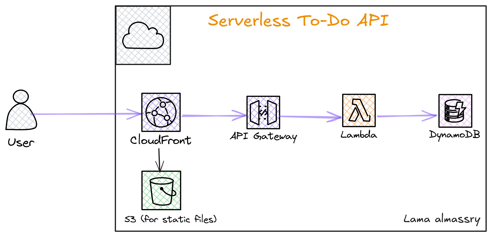
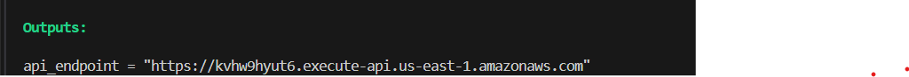
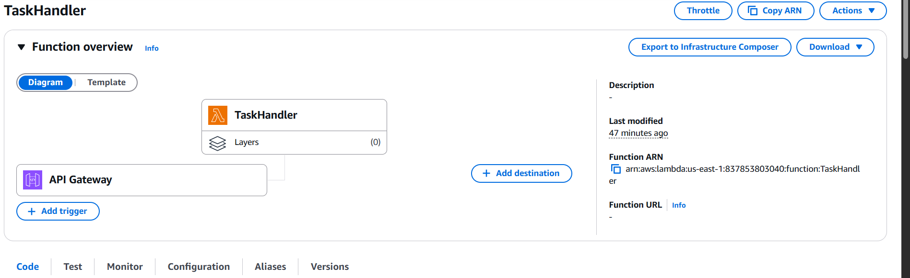
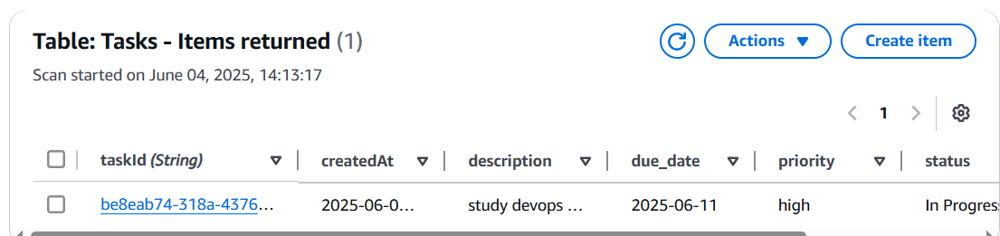
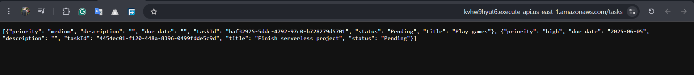
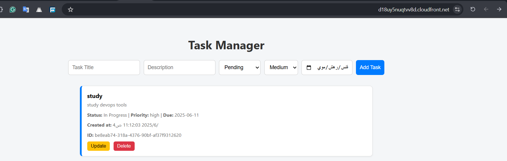

## 📘 Serverless To-Do App – AWS Lambda, API Gateway, DynamoDB, S3 & CloudFront



This project is a **serverless task management app** that demonstrates how to build scalable, event-driven systems using AWS services and Infrastructure as Code (Terraform).

The app includes both:
- A **RESTful backend API** powered by Lambda, API Gateway, and DynamoDB.
- A **static frontend UI** hosted on S3 and served via CloudFront.

---

## 💡 Updated Project Idea

The goal of this project is to showcase a full-stack serverless architecture to manage tasks (like a to-do list) with a functional web interface.

### ✅ Why serverless?
- Zero server maintenance
- Event-driven and auto-scaling
- Cost-efficient (pay-per-use)
- Easily deployed via Terraform

### 💼 Use Case:
A user-friendly task manager that allows users to:
- Create tasks via a frontend UI or API
- View, update, or delete them
- Hosted and served globally via **CloudFront**

---

## 🧩 Architecture Overview

```plaintext
Browser (CloudFront UI)
      ↓
S3 Static Website (HTML/CSS/JS)
      ↓
API Gateway (REST API)
      ↓
Lambda Functions (CRUD Logic)
      ↓
DynamoDB (NoSQL Task Storage)


---

## 📷 Screenshots

Ensure all these image files exist under `images/`:

```md
| Description             | Screenshot                                        |
| ----------------------- | ------------------------------------------------- |
| Terraform apply Output  |            |
| Lambda Function Code    |                      |
| DynamoDB Table View     |                  |
| API Gateway Test        |                            |
| CloudFront              |             |
                                                                |

## 🚀 Features
- 🌐 Web UI hosted via S3 + CloudFront
- ✅ Create a new task  
- 📖 Get all existing tasks  
- ✏️ Update a specific task  
- ❌ Delete a task  
- 🛡️ IAM-secured Lambda functions  
- 📈 Monitored with CloudWatch

---

## 🧪 API Endpoints

| Method | Endpoint          | Description   |
| ------ | ----------------- | ------------- |
| POST   | `/tasks`          | Create task   |
| GET    | `/tasks`          | Get all tasks |
| PUT    | `/tasks/{taskId}` | Update task   |
| DELETE | `/tasks/{taskId}` | Delete task   |

> Example base URL:
> `https://eoss66b47k.execute-api.us-east-1.amazonaws.com`

---

## 📷 Screenshots

| Description             | Screenshot                                        |
| ----------------------- | ------------------------------------------------- |
| Terraform apply Output   |
 |
| Lambda Function Code    |
  |
| DynamoDB Table View     |
  |
| API Gateway Test        |
  |
| Cloudfront              |
  |

 


---

## 🧰 Setup Instructions (Terraform)

Clone the repo

```bash
terraform init
terraform apply
```
Deploy your Lambda code (zip file upload)

Upload frontend to S3 and link CloudFront

Visit CloudFront URL to interact with your app
---

## 📚 Learning Outcomes
* Build full-stack serverless apps on AWS
* Use S3 & CloudFront for global frontend hosting
* Design and deploy serverless applications with best practices
* Use AWS Lambda + API Gateway + DynamoDB for REST APIs
* Write Terraform to manage cloud infrastructure
* Secure resources with IAM roles and policies
* Use CloudWatch for debugging and monitoring

---

