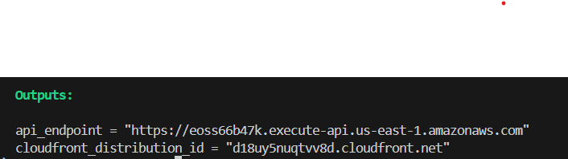

---

## 📘 Serverless To-Do API – AWS Lambda, API Gateway, DynamoDB


This project is a **serverless task management API** designed to demonstrate how to build scalable, event-driven applications using AWS services and Infrastructure as Code (Terraform).

The application allows users to **create, view, update, and delete tasks** (i.e., to-do items). It is designed with full **serverless architecture**—no servers are manually provisioned or maintained. All backend logic is executed by **Lambda functions**, requests are routed by **API Gateway**, and data is stored in **DynamoDB**. Optionally, a frontend client (e.g., hosted on S3) can interact with the API.

---

## 💡 Project Idea

The goal of this project is to showcase how modern serverless patterns can be used to create efficient and cost-effective REST APIs. This system simulates a **simple to-do list app**, but the underlying principles can be applied to more complex microservices.

- **Why serverless?**
  - No server maintenance
  - Highly scalable (event-driven)
  - Cost-effective (pay-per-use)
  - Easily deployable with Infrastructure as Code

- **Use Case**:
  A user wants to keep track of personal or project-based tasks. The app lets them:
  - Create new tasks
  - View existing tasks
  - Modify or complete tasks
  - Remove tasks that are no longer needed
---

## 🧩 Architecture

```plaintext
Client (browser/cURL)
      ↓
API Gateway (REST)
      ↓
Lambda Functions (CRUD handlers)
      ↓
DynamoDB Table (Tasks)
```

---


## 🛠️ AWS Services Breakdown

| Service           | Purpose                                                                 |
|-------------------|-------------------------------------------------------------------------|
| **API Gateway**    | Handles HTTP requests and routes them to Lambda functions              |
| **Lambda**         | Serverless compute to run the Python functions (create/read/update/delete tasks) |
| **DynamoDB**       | NoSQL database to store task data                                       |
| **IAM**            | Securely manages roles and permissions for Lambda and other services   |
| **CloudWatch**     | Logs API requests and Lambda executions for monitoring/debugging       |
| **S3 (optional)**  | Host a static frontend for the API (e.g., a simple HTML/JS UI)         |
| **Terraform**      | Manages the deployment and configuration of all AWS resources          |

---

## 🚀 Features

- ✅ Create a new task  
- 📖 Get all existing tasks  
- ✏️ Update a specific task  
- ❌ Delete a task  
- 🛡️ IAM-secured Lambda functions  
- 📈 Monitored with CloudWatch

---

## 🧪 API Endpoints

| Method | Endpoint          | Description   |
| ------ | ----------------- | ------------- |
| POST   | `/tasks`          | Create task   |
| GET    | `/tasks`          | Get all tasks |
| PUT    | `/tasks/{taskId}` | Update task   |
| DELETE | `/tasks/{taskId}` | Delete task   |

> Example base URL:
> `https://61d6ys5is6.execute-api.us-east-1.amazonaws.com`

---

## 📝 Example Requests

### ✅ Create Task

```bash
curl -X POST https://<api_url>/tasks \
  -H "Content-Type: application/json" \
  -d '{"id": "task1", "title": "Finish serverless project", "priority": "high", "due_date": "2025-06-05"}'
```


### 📖 Get All Tasks

```bash
curl https://<api_url>/tasks
```


### ✏️ Update Task

```bash
curl -X PUT https://<api_url>/tasks/{taskId} \
  -H "Content-Type: application/json" \
  -d '{"title":"Play", "priority":"medium"}'
```


### ❌ Delete Task

```bash
curl -X DELETE https://<api_url>/tasks/{taskId}
```


---

## 📷 Screenshots

| Description             | Screenshot                                        |
| ----------------------- | ------------------------------------------------- |
| Terraform apply Output   |
 |
| Lambda Function Code    |
  |
| DynamoDB Table View     |
  |
| API Gateway Test        |
    |
|    |


---

## 🧰 Setup Instructions (Terraform)

1. Clone the repo

```bash
terraform init
terraform apply
```

4. Deploy your Lambda code (zipped `.zip` file)
5. Test the API using Postman or `curl`

---

## 📚 Learning Outcomes

* Design and deploy serverless applications with best practices
* Use AWS Lambda + API Gateway + DynamoDB for REST APIs
* Write Terraform to manage cloud infrastructure
* Secure resources with IAM roles and policies
* Use CloudWatch for debugging and monitoring

---

